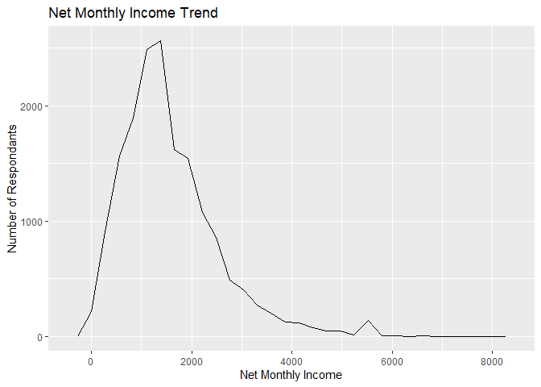
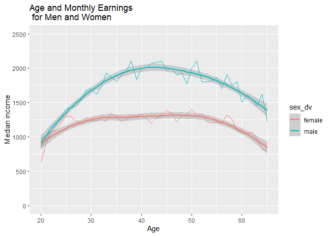
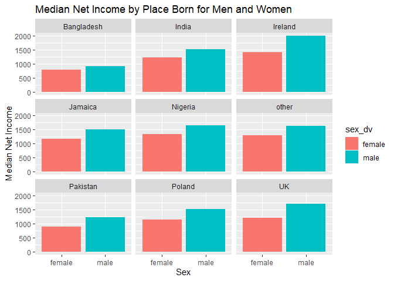
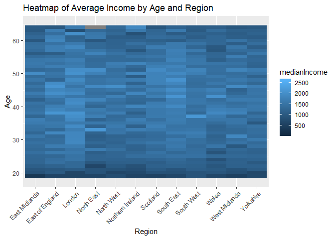
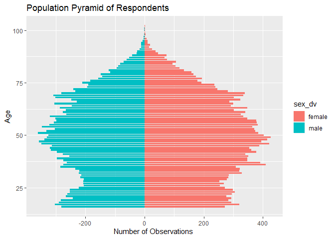

Statistical assignment 4
================
Amy Wonnacott
26/02/2020

In this assignment you will need to reproduce 5 ggplot graphs. I supply
graphs as images; you need to write the ggplot2 code to reproduce them
and knit and submit a Markdown document with the reproduced graphs (as
well as your .Rmd file).

First we will need to open and recode the data. I supply the code for
this; you only need to change the file paths.

    ```r
    library(tidyverse)
    Data8 <- read_tsv("C:/Users/User/Documents/GitHub/dataan3/UKDA-6614-tab/tab/ukhls_w8/h_indresp.tab")
    Data8 <- Data8 %>%
        select(pidp, h_age_dv, h_payn_dv, h_gor_dv)
    Stable <- read_tsv("C:/Users/User/Documents/GitHub/dataan3/UKDA-6614-tab/tab/ukhls_wx/xwavedat.tab")
    Stable <- Stable %>%
        select(pidp, sex_dv, ukborn, plbornc)
    Data <- Data8 %>% left_join(Stable, "pidp")
    rm(Data8, Stable)
    Data <- Data %>%
        mutate(sex_dv = ifelse(sex_dv == 1, "male",
                           ifelse(sex_dv == 2, "female", NA))) %>%
        mutate(h_payn_dv = ifelse(h_payn_dv < 0, NA, h_payn_dv)) %>%
        mutate(h_gor_dv = recode(h_gor_dv,
                         `-9` = NA_character_,
                         `1` = "North East",
                         `2` = "North West",
                         `3` = "Yorkshire",
                         `4` = "East Midlands",
                         `5` = "West Midlands",
                         `6` = "East of England",
                         `7` = "London",
                         `8` = "South East",
                         `9` = "South West",
                         `10` = "Wales",
                         `11` = "Scotland",
                         `12` = "Northern Ireland")) %>%
        mutate(placeBorn = case_when(
                ukborn  == -9 ~ NA_character_,
                ukborn < 5 ~ "UK",
                plbornc == 5 ~ "Ireland",
                plbornc == 18 ~ "India",
                plbornc == 19 ~ "Pakistan",
                plbornc == 20 ~ "Bangladesh",
                plbornc == 10 ~ "Poland",
                plbornc == 27 ~ "Jamaica",
                plbornc == 24 ~ "Nigeria",
                TRUE ~ "other")
        )
    ```

Reproduce the following graphs as close as you can. For each graph,
write two sentences (not more\!) describing its main message.

1.  Univariate distribution (20 points).

<!-- end list -->

``` r
ggplot(Data,
       aes(x = h_payn_dv)) +
  geom_freqpoly() +
  xlab("Net Monthly Income") +
  ylab("Number of Respondants")+
  ggtitle("Net Monthly Income Trend")
```

<!-- --> The
graph shows that most respondents have a monthly income of around
£2,000. A significant number of people earn between £2,000- £4,000,
however the number earning more than this is significantly fewer.

2.  Line chart (20 points). The lines show the non-parametric
    association between age and monthly earnings for men and women.
    
    ``` r
    byAgeSex <- Data %>%
      mutate(h_sex_dv = ifelse(sex_dv == 1, "male",
                           ifelse(sex_dv == 2, "female", NA))) %>%
      filter(!is.na(sex_dv)) %>%
      group_by(h_age_dv, sex_dv) %>%
      summarise(
    medianIncome = median(h_payn_dv, na.rm = TRUE)
      )
    
    byAgeSex%>%
      ggplot(aes(x = h_age_dv, y = medianIncome, colour = sex_dv)) +
        geom_line() +
        geom_smooth() +
        xlim(20,65) +
        ylim(0,2500) +
        xlab("Age") +
        ylab("Median income")+
        ggtitle("Age and Monthly Earnings \n for Men and Women")
    ```
    
    <!-- --> This
    line graph shows that men earn consistently more than women above
    age 20, and the gap is greatest at around age 42, when men earn an
    average of £750 more than women.

3.  Faceted bar chart (20 points).

Median net income by placeborn

    ```r
    byPlaceBorn <- Data %>%
      select(sex_dv, placeBorn, h_payn_dv) %>%
      filter(!is.na(sex_dv)) %>%
      filter(!is.na(placeBorn))%>%
      group_by(placeBorn, sex_dv) %>%
      summarise(
    medianIncome = median(h_payn_dv, na.rm = TRUE))
    
    byPlaceBorn %>%
    ggplot(
      aes(x = sex_dv, y = medianIncome, fill = sex_dv)) +
      geom_bar(stat = "identity") + 
      facet_wrap(~ placeBorn) +
      xlab("Sex") +
      ylab("Median Net Income")+
      ggtitle("Median Net Income by Place Born for Men and Women")
    ```
    
    <!-- -->

These bar charts show that income is greatly affected by place born.
People born in Bangladesh or Pakistan earn significantly less than those
born in the UK or Ireland.There is always a difference in pay between
men and women.

4.  Heat map (20 points).

Heatmap of income by age and sex.

``` r
heatmap<- Data%>%
    filter(!is.na(h_gor_dv))%>%
    filter(!is.na(h_age_dv))%>%
  group_by(h_gor_dv, h_age_dv) %>%
    summarise(medianIncome= median(h_payn_dv, na.rm=TRUE))

heatmap %>%
    ggplot(mapping= aes(x= h_gor_dv, y= h_age_dv))+
  geom_tile(mapping= aes(fill = medianIncome))+
  theme(axis.text.x = element_text(angle = 45, hjust = 1))+
  xlab("Region")+
  ylab("Age")+
  ylim(18,65)+
  ggtitle("Heatmap of Average Income by Age and Region")
```

<!-- --> This
heat map shows that the median income in London is significantly higher
than in other regions and starting at a younger age, followed by the
South East. The regions with the consistent lowest median pay are Wales,
the North East and Norther Ireland

5.  Population pyramid (20 points).

<!-- end list -->

``` r
Age <- Data %>%
        group_by(h_age_dv) %>%
        filter(!is.na(sex_dv)) %>%
        count(sex_dv)
        
Age %>%
    ggplot(
    aes(x = h_age_dv, y = ifelse(sex_dv == "female", n, -n), fill = sex_dv)) +
    geom_bar(stat = "identity", width =  .85) +
    coord_flip() +
    ylab("Number of Observations ") +
    xlab("Age")+
    ggtitle("Population Pyramid of Respondents")
```

<!-- -->

The population pyramid shows that there were more female respondents
than male respondents across all ages, but particularly between the age
of 50, where the number of female respondents exceeded 400, and the
number of male respondents was around 350.
